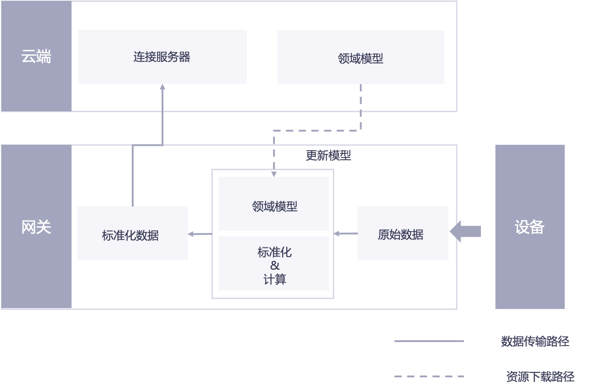

# 数据模型化

完成数据采集后，Edge的另一个核心功能就是按照云端定义的设备模型，将采集到的数据模型化，并映射到对应的设备上。

*图：Edge数据处理流程*

如上图所示，模型化的过程主要有：

1. 通过前置规约完成数据采集

2. 将原始数据测点映射到设备模型中定义的标准数据测点上，Edge可以实时更新云端定义的最新模型，以保证Edge中处理的模型是最新的。

3. 在模型映射的过程中，常常需要用到很多公式和计算，如将原始测点Ra通过运算一定的运算f，赋值到设备领域点Da上，即Da=f（Ra）。Edge不仅提供一些常规的计算公式，还支持用户基于领域点自定义计算脚本，实现对测点映射的复杂计算处理；

4. 原始测点经过运算，映射处理后，变成标准的设备领域模型数据点，然后上送到云端。
