# 设备模板管理

设备模板是设备接入的桥梁，包含了设备模型测点（领域点）与设备实例测点（实采点）之间的映射关系，以及设备接入所用的通信规约程序。

设备模板是设备接入的桥梁，由规约与设备测点映射关系两部分组成。对于一个实际的设备，其设备测点的名称多数情况下是客户化的，系统无法直接识别此客户化的名称。因此，一方面，需通过映射，将客户化的实际测点与标准化的设备模型领域点对应起来。另一方面，需配置设备接入的规约。

设备模板的创建步骤：

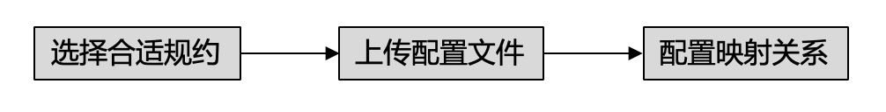

*图：设备模板管理三要素*

设备模板的创建主要有2种方式，一种是全新创建，另一种是基于原有设备模板复制创建，而后基于此模板做修改。后者适用于两种设备模板近似的场景，通过复制的方式获取副本而后稍作修改得到新模板，可减少实施的工作量。

## 创建设备模板——全新创建

在导航菜单中点击 **模板管理**，可浏览本客户下用到的所有设备模板。点击 **新建设备模板**，会弹出对话框供，用户首先填写需要添加的设备基本信息，点击 **保存**。如下图所示：

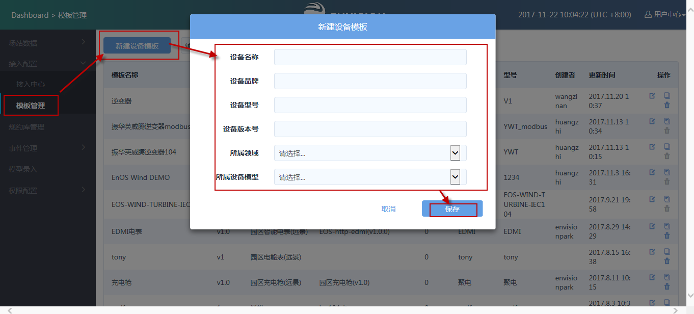

*图：全新创建设备模板*

点击新建好的模板条目后按钮，进入模板详情页面。

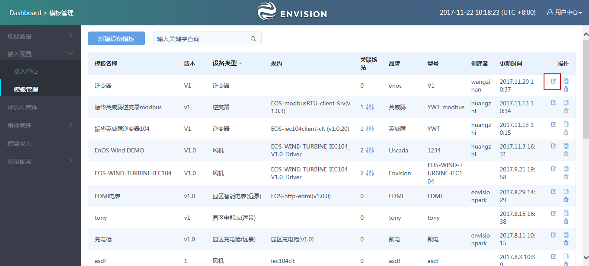

*图：点击进入模板详情*

模板详情页面包括3部分，最上方为模板的基本信息编辑栏，中部为点表上传栏，下部为模板选择与映射关系配置栏，如下图所示：

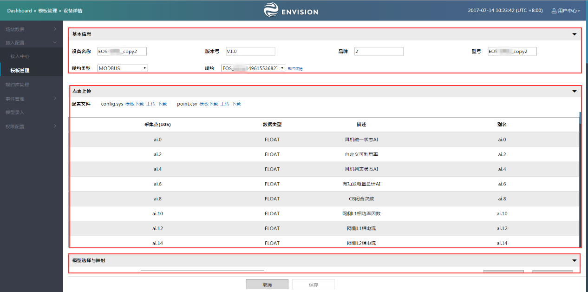

*图：设备模板编辑页面——以风机为例*

### 基本信息

填写基本信息，选择规约类型和具体规约。需要注意，先选择规约类型，才能选择对应类型下的规约。如下图所示：

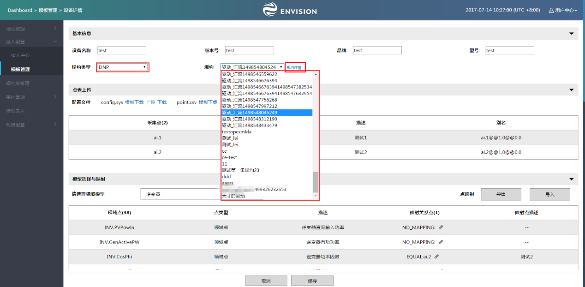

*图：模板基本信息编辑*

可点击规约详情链接，在弹出的对话框中，光标置于图标处，可查看各规约的描述信息，以确定合适的规约。若没有找到合适规约，请联系平台系统管理员。如下图所示：

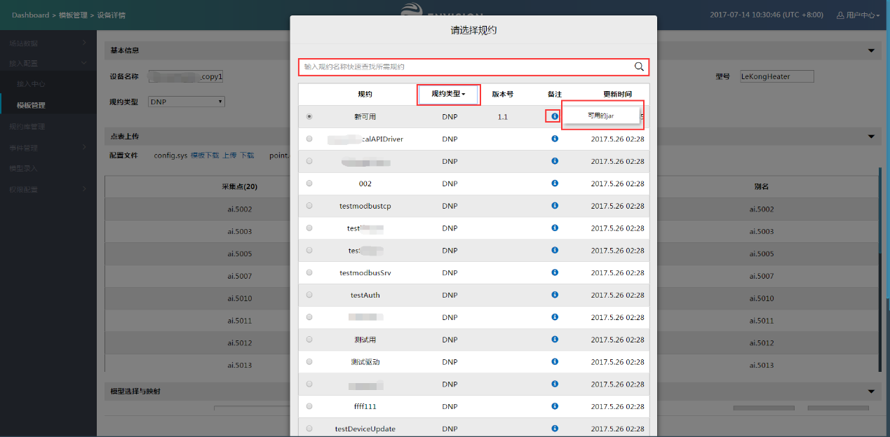

*图：规约详情页*

### 点表上传

config.sys文件是与通信规约相关的参数配置文件，point.csv表是设备实际的测点表。

下载config.sys模板和point.csv模板，填写完成后，上传config.sys文件和point.csv文件。

上一步通信规约选择完成后，这里上传point.csv表若成功，则会在下方的预览栏中看到point.csv表中的测点信息，如下图所示：

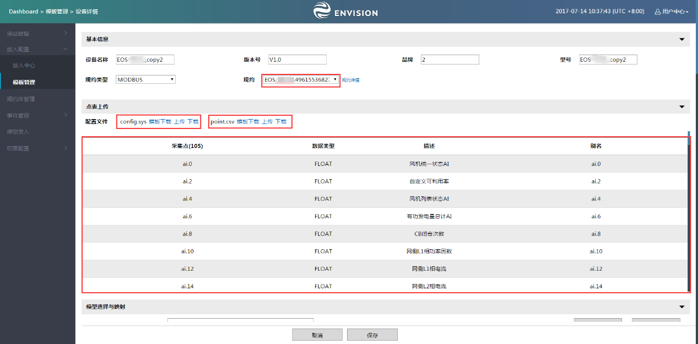

*图：规约选择及点表导入*

**注意**：

- point.csv点表需为UTF-8 BOM格式，格式不正确可能导致显示出错等问题；

- 若point.csv表里的"别名"列有值，在进行更新点表操作，即上传一份新的点表时，需首先上传一份空的点表覆盖原有的，再上传实际的点表，以免出错。

### 模型选择与配置映射关系

通过配置映射关系，将客户化的实际点与标准化的设备模型点对应起来。第一步，选择采用的标准设备模型，第二步，配置映射关系。如下图所示，选择所需采用的标准设备模型，逐点配置映射关系。

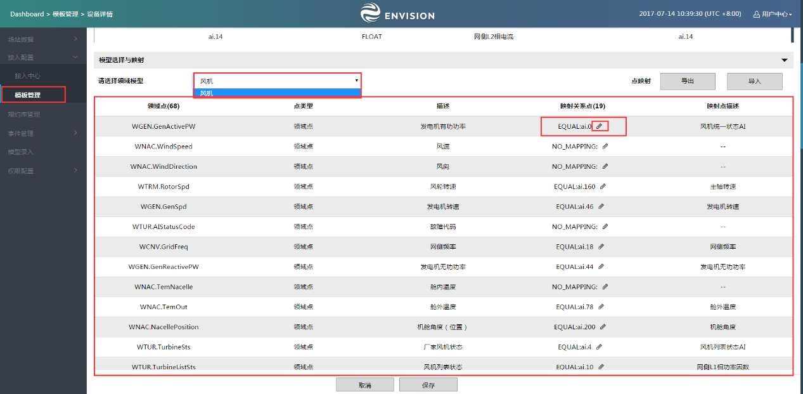

*图：标准模型选择及映射关系配置*

配置映射关系时，可点击标准模型点右侧的按钮，在弹出的对话框中选择其所要对应的实际采集点，如下图所示：

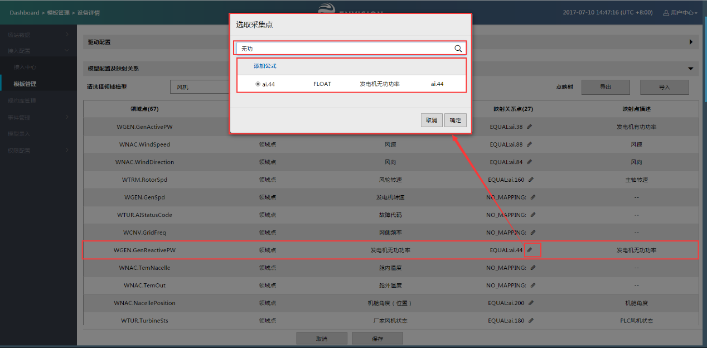

*图：映射关系配置*

其中，在弹出的对话框中，可在搜索栏中输入采集点点名的关键词，系统会过滤出包含关键词的测点供用户选择，如下图所示。

对于简单一一对应的映射关系，直接勾选相应的测点即可；对于复杂的映射关系，可点击添加公式按钮，配置映射公式，如下图所示：

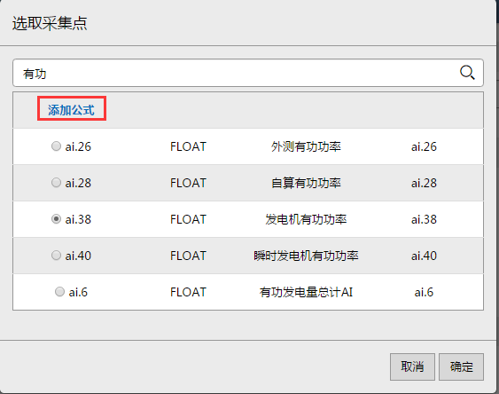

*图：添加公式按钮*

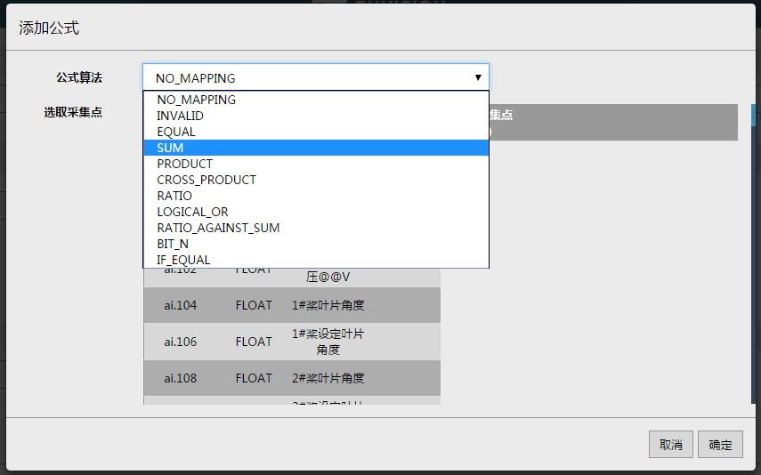

*图：选择公式*

以"SUM"相加公式为例，公式算法栏中选择"SUM"，选取采集点框内按相加顺序点击相应点后的，即可完成添加，如下图
4‑39所示，添加的公式为"ai.0+ai.6"，顺序和点击顺序一致：

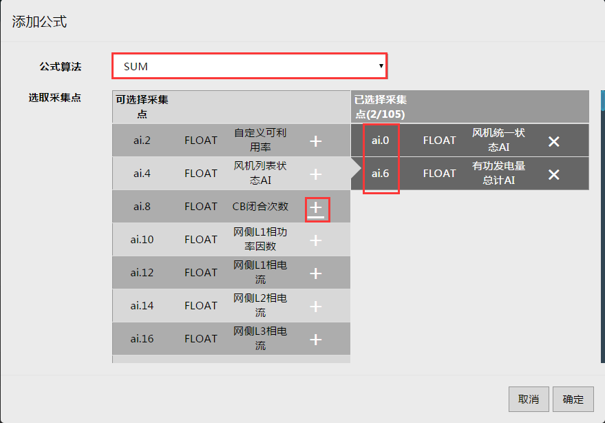

*图：SUM公式添加说明*

**说明**：添加顺序在某些公式中很重要，如在cross
product操作中，公式算法栏选择"cross
product"，按顺序选择四个点，添加的公式为"(ai.0\*ai.4+ai.8\*ai.12)"，图中操作数一栏类似于系数，为0则不操作，例如下图中操作数为0.01，则最后添加的公式为"(ai.0\*ai.4+ai.8\*ai.12)\*0.01"。

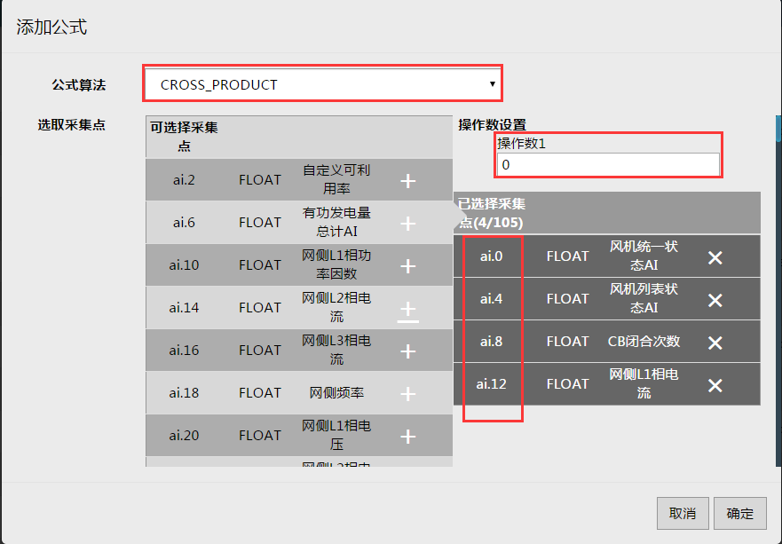

*图：点选择顺序与操作数*

### 批量配置映射关系

点击导出按钮，可下载领域点映射表，用户可在表中填完所有的映射关系后，再点击导入按钮上传映射表，实现一次性完成所有映射关系配置，如下图所示：

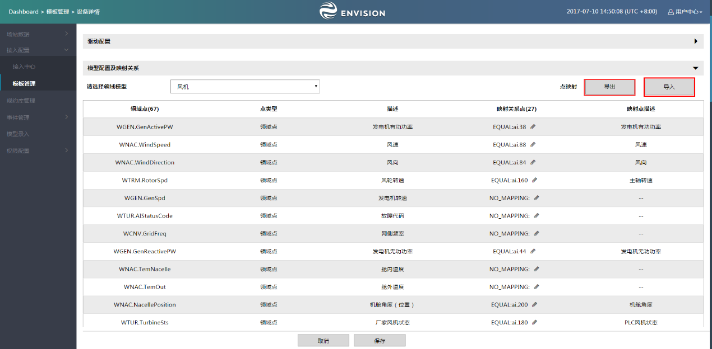

*图：批量配置映射关系*

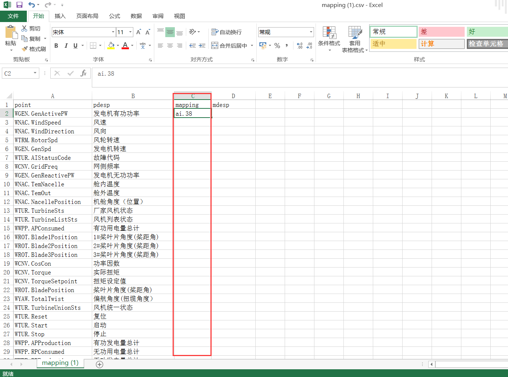

*图：映射关系表*

**注意**：在映射关系表的mapping列下填写采集点的点号即可，mdesp一列指采集点的描述，不需要填写。在成功上传映射关系表后，再点击 **下载领域点列表** 按钮，即可下载包含了映射关系的映射关系表，此时的表中已包含了采集点的描述（因描述可以从驱动配置文件point.csv表中自动获取）。

完成映射关系配置后，各标准模型点对应的采集点点号及描述关系可在页面中看到，如下图所示，点击保存后完成设备模板的编辑操作。

**说明**：

- 并非所有设备模型点都需要配置映射关系，具体根据各领域的应用需求而定；

- 需要添加公式映射的点必须通过手动添加的方式来配置，无法直接使用导入/导出来操作；

- 已完成映射的表点击 **导出** 后，对于那些通过配公式映射的点，不会出现在导出后的csv文件中，但是在后台是存在的。

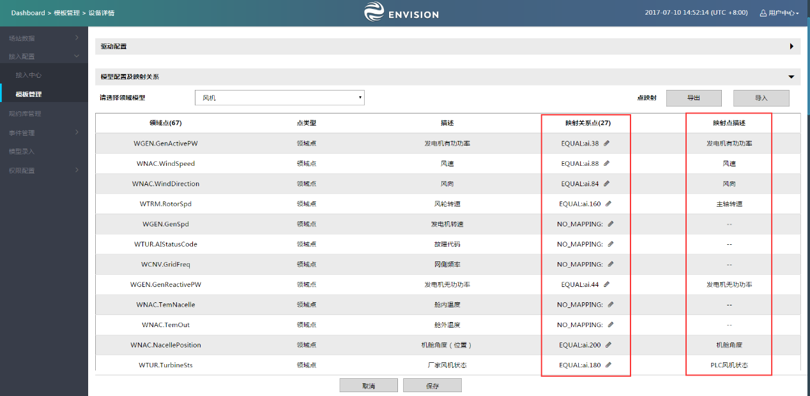

*图：完成映射关系配置*

### 创建设备模板——复制创建

在模板管理菜单页可查看本客户下所有设备模板，当某个新设备的设备模板与已有设备模板类似时，可通过复制创建的方式，减少实施工作量。

找到所需要复制的原始设备模板，点击复制按钮，填写新设备模板的名称后，即可完成创建。

**注意**：设备模板名称必须唯一，不可重名，否则会报错。

此后，用户只需要对此设备模板做相应的修改以满足需要即可，如下图所示：

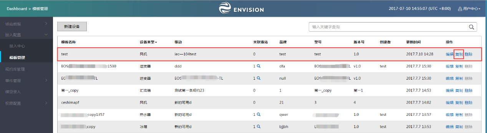

*图：复制设备模板*

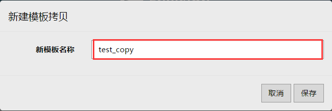

*图：填写新设备模板的名称*

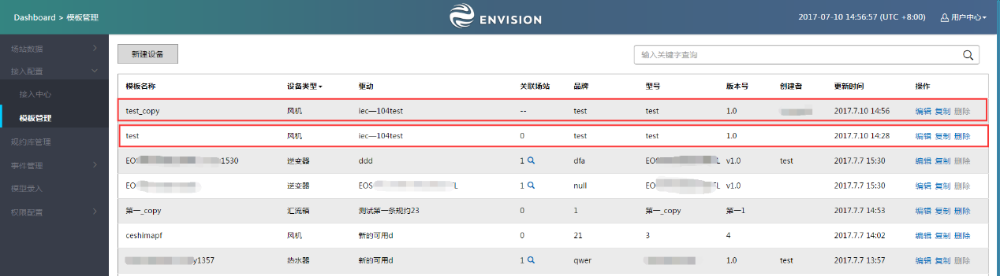

*图：完成设备模板复制*

## 修改设备模板

在 **模板管理** 页进入目标设备模板详情页面，如下图所示：

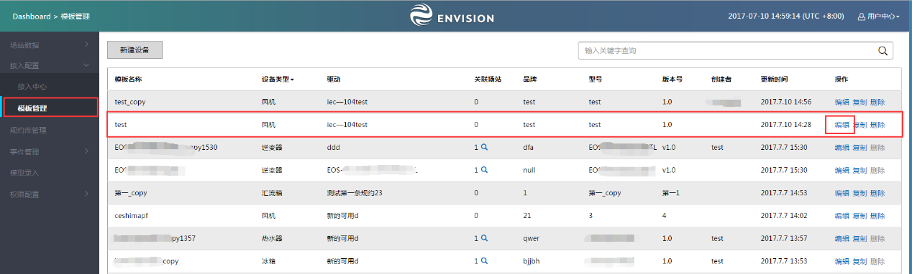

*图：设备模板管理页面中进入的目标设备模板详情页面*

由于同一个设备模板可能被本客户下多个场站的设备所共用，因此，对设备模板的修改就有可能会影响到多个场站。而假若只有某几个场站希望采用修改后的设备模板，另外几个仍然希望采用原来的设备模板，此时，便需要有一种机制来支持这样的操作，机制描述如下：

用户在修改设备模板时，可以看到其权限范围内使用了此设备模板的场站，该用户可以主动决定是否对所有相关场站发生影响，还是只影响部分。若为前者，则直接修改设备模板原件；若为后者，则会为需要受影响的场站生成一个新的设备模板。

在 **模板管理** 页面，点击 **关联** 按钮，可弹出对话框，供用户查看具体的场站，如下图所示：

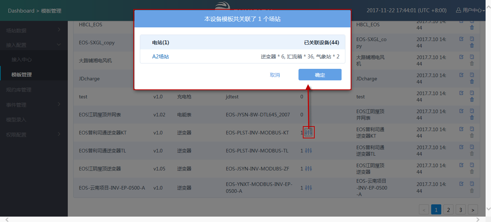

*图：查看关联场站*

在修改后点击 **保存** 按钮时，会弹出对话框，供用户选择此次修改需要影响的场站。若所有相关场站都被勾选，则会直接修改模板原件；若只勾选了部分场站，则会为这部分场站生成一个新的设备模板并进行关联，原有设备模板不变，并只关联那些不需要受影响的场站。如下图所示：

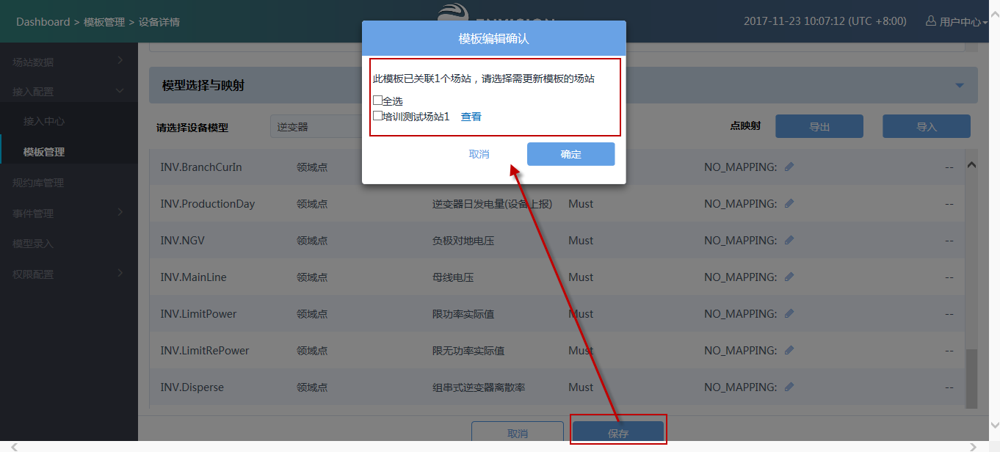

*图：选择要影响的场站*

对于没有关联场站的设备模板可以进行删除操作，如下图所示：

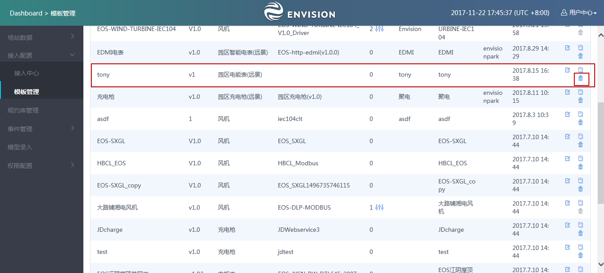

*图：删除设备模板*
